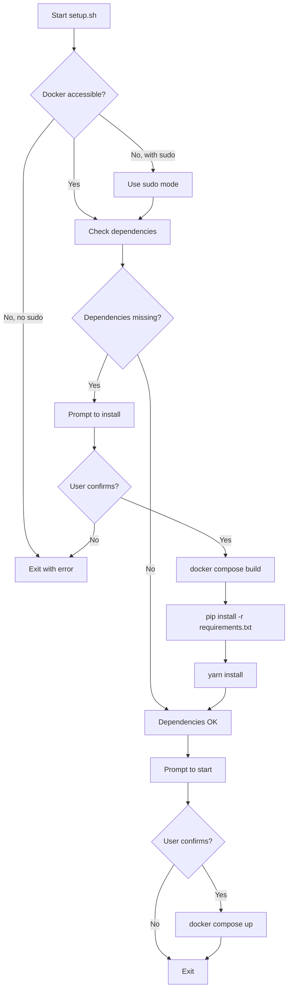

<div align="center">
  <p><strong>A full-stack mock API platform for rapid prototyping and internal testings</strong></p>
  <p>Built with FastAPI and Vue 3 | Docker-Ready | Enterprise-Grade Testing Solution</p>
  
  <h1>🎭 Mimic Mock API Engine</h1>
  <p><strong>The "Infrastructure-First" Mocking Engine for .NET 9 & Vue 3</strong></p>

  <p>
    
    
    
    
    
  </p>

<table>
  <tr>
    <th>Scenario</th>
    <th>How Mimic Helps</th>
  </tr>
  <tr>
    <td><strong>Frontend Development</strong></td>
    <td>Develop UI without waiting for backend APIs to be ready</td>
  </tr>
  <tr>
    <td><strong>API Testing</strong></td>
    <td>Create mock endpoints to test API consumers</td>
  </tr>
  <tr>
    <td><strong>Integration Testing</strong></td>
    <td>Simulate third-party API responses in controlled environments</td>
  </tr>
  <tr>
    <td><strong>Demo & Prototyping</strong></td>
    <td>Quickly spin up working prototypes for stakeholder demos</td>
  </tr>
  <tr>
    <td><strong>CI/CD Testing</strong></td>
    <td>Provide consistent mock data for automated test pipelines</td>
  </tr>
</table>

---

## 🚀 Key Features

<div>
  <details open>
    <summary><strong>🔥 Full-Stack Solution</strong></summary>
    <ul>
      <li>FastAPI backend with Python 3.12</li>
      <li>Vue 3 frontend with TypeScript support</li>
      <li>RESTful API architecture</li>
    </ul>
  </details>

  <details open>
    <summary><strong>🐳 Docker-First Development</strong></summary>
    <ul>
      <li>Pre-configured Docker Compose setup</li>
      <li>One-command startup</li>
      <li>Isolated development environment</li>
      <li>No local SDK installation required</li>
    </ul>
  </details>

  <details open>
    <summary><strong>⚡ Hot Reload & Live Development</strong></summary>
    <ul>
      <li>Backend: <code>uvicorn --reload</code> for automatic Python reload</li>
      <li>Frontend: Vite HMR for instant UI updates</li>
      <li>Zero restart needed during development</li>
    </ul>
  </details>

  <details open>
    <summary><strong>🔧 Flexible Configuration</strong></summary>
    <ul>
      <li>Environment-based settings (.env support)</li>
      <li>Customizable ports and versions</li>
      <li>Multi-environment support (Dev, Staging, Prod)</li>
    </ul>
  </details>

  <details open>
    <summary><strong>📦 Modern Tech Stack</strong></summary>
    <ul>
      <li>Latest FastAPI and Vue 3 frameworks</li>
      <li>TypeScript for type safety</li>
      <li>Yarn for fast package management</li>
      <li>Vite for blazing-fast builds</li>
    </ul>
  </details>
</div>

---

## 🛠 Tech Stack

### Backend Stack

<table>
  <tr>
    <th>Technology</th>
    <th>Version</th>
    <th>Purpose</th>
  </tr>
  <tr>
    <td><strong>Python</strong></td>
    <td>3.12</td>
    <td>Runtime for the backend service</td>
  </tr>
  <tr>
    <td><strong>FastAPI</strong></td>
    <td>Latest</td>
    <td>Modern, high-performance Web API framework</td>
  </tr>
  <tr>
    <td><strong>Uvicorn</strong></td>
    <td>Latest</td>
    <td>ASGI server with reload support</td>
  </tr>
</table>

### Frontend Stack

<table>
  <tr>
    <th>Technology</th>
    <th>Version</th>
    <th>Purpose</th>
  </tr>
  <tr>
    <td><strong>Vue.js</strong></td>
    <td>3.x</td>
    <td>Progressive JavaScript framework for UI</td>
  </tr>
  <tr>
    <td><strong>TypeScript</strong></td>
    <td>5.x</td>
    <td>Type-safe development with IntelliSense</td>
  </tr>
  <tr>
    <td><strong>Vite</strong></td>
    <td>Latest</td>
    <td>Next-gen frontend build tool (HMR)</td>
  </tr>
  <tr>
    <td><strong>Yarn</strong></td>
    <td>Latest</td>
    <td>Fast, reliable dependency management</td>
  </tr>
</table>

### DevOps Stack

<table>
  <tr>
    <th>Technology</th>
    <th>Version</th>
    <th>Purpose</th>
  </tr>
  <tr>
    <td><strong>Docker</strong></td>
    <td>20.10+</td>
    <td>Containerization for consistent environments</td>
  </tr>
  <tr>
    <td><strong>Docker Compose</strong></td>
    <td>2.0+</td>
    <td>Multi-container orchestration</td>
  </tr>
</table>

---

## 📦 Prerequisites

Before you begin, ensure you have the following installed:

<table>
  <tr>
    <th>Software</th>
    <th>Minimum Version</th>
    <th>Download Link</th>
  </tr>
  <tr>
    <td><strong>Docker</strong></td>
    <td>20.10+</td>
    <td><a href="https://www.docker.com/get-started">Get Docker</a></td>
  </tr>
  <tr>
    <td><strong>Docker Compose</strong></td>
    <td>2.0+</td>
    <td><em>Included in Docker Desktop</em></td>
  </tr>
</table>

> **💡 Note**: Docker Desktop for Windows/Mac includes Docker Compose automatically. Linux users may need to install it separately.

### Optional (for non-Docker development)

<table>
  <tr>
    <th>Software</th>
    <th>Version</th>
    <th>Purpose</th>
  </tr>
  <tr>
    <td>Python</td>
    <td>3.12+</td>
    <td>Run backend without Docker</td>
  </tr>
  <tr>
    <td>Node.js</td>
    <td>20+</td>
    <td>Run frontend without Docker</td>
  </tr>
  <tr>
    <td>Yarn</td>
    <td>Latest</td>
    <td>Frontend package management</td>
  </tr>
</table>

---

## ⚡ Quick Start

### Step 1: Clone the Repository

```bash
git clone https://github.com/hoysengleang/Mimic-Mock-Api-Best.git
cd Mimic-Mock-Api-Best
```

### Step 2: Configure Environment

```bash
# Copy environment template
cp .env.examplle .env

# (Optional) Edit .env to customize ports
nano .env  # or use your preferred editor
```

### Step 3: Start with Setup Script (Recommended)

```bash
# Make setup script executable
chmod +x setups/setup.sh

# Run automated setup
./setups/setup.sh
```

The setup script will:
- ✅ Check Docker permissions
- ✅ Verify dependencies
- ✅ Install missing packages
- ✅ Start the application

### Step 4: Manual Start (Alternative)

```bash
# Build and start all services
docker-compose up --build

# Or run in detached mode
docker-compose up -d
```

### Step 5: Access the Application

<table>
  <tr>
    <th>Service</th>
    <th>URL</th>
    <th>Purpose</th>
  </tr>
  <tr>
    <td><strong>Frontend UI</strong></td>
    <td><a href="http://localhost:3000">http://localhost:3000</a></td>
    <td>Main web interface for managing mock APIs</td>
  </tr>
  <tr>
    <td><strong>Backend API</strong></td>
    <td><a href="http://localhost:5000">http://localhost:5000</a></td>
    <td>RESTful API endpoints</td>
  </tr>
  <tr>
    <td><strong>API Docs</strong></td>
    <td><a href="http://localhost:5000/docs">http://localhost:5000/docs</a></td>
    <td>FastAPI Swagger/OpenAPI documentation</td>
  </tr>
</table>

---

## 📁 Detailed Project Structure

### Root Directory Layout

```
Mimic-Mock-Api-Best/
├── 📂 src/                      # Source code directory
│   ├── 📂 Mimic.API/            # Backend (FastAPI)
│   └── 📂 Mimic.UI/             # Frontend (Vue 3 + TypeScript)
│
├── 📂 setups/                   # Setup and initialization scripts
│   └── setup.sh                 # Automated setup wizard
│
├── 📂 data/                     # Persistent data storage (auto-created)
│   └── (mock API data files)
│
├── 📄 docker-compose.yml        # Docker orchestration configuration
├── 📄 .env.examplle            # Environment variables template
├── 📄 .env                      # Your local environment config (git-ignored)
├── 📄 .gitignore                # Git ignore rules
├── 📄 .gitattributes            # Git line-ending configuration
├── 📄 LICENSE                   # Project license
└── 📄 README.md                 # This file
```

---

### 🎯 Backend Structure (`src/Mimic.API/`)

<details open>
<summary><strong>📂 Click to expand backend structure</strong></summary>

```
src/Mimic.API/
├── 📂 app/
│   ├── 📂 api/
│   │   ├── deps.py              # Dependency providers
│   │   └── 📂 routes/
│   │       ├── health.py        # Health check endpoints
│   │       └── mocks.py         # Mock CRUD + mock responder
│   ├── 📂 core/
│   │   └── config.py            # Environment-based settings
│   ├── 📂 db/
│   │   └── store.py             # JSON-backed mock storage
│   ├── 📂 schemas/
│   │   └── mock.py              # Pydantic models
│   ├── __init__.py
│   └── main.py                  # FastAPI app entry point
│
├── 📄 requirements.txt          # Python dependencies
└── 📄 Mimic.API.http            # HTTP request samples
```

#### 📖 Key Files Explained

<table>
  <tr>
    <th>File</th>
    <th>Purpose</th>
    <th>When to Modify</th>
  </tr>
  <tr>
    <td><code>app/main.py</code></td>
    <td>FastAPI app startup and router wiring</td>
    <td>Adding middleware, routers, app-level settings</td>
  </tr>
  <tr>
    <td><code>app/db/store.py</code></td>
    <td>JSON-backed mock persistence layer</td>
    <td>Changing storage strategy or indexes</td>
  </tr>
  <tr>
    <td><code>app/schemas/mock.py</code></td>
    <td>Pydantic models for request/response</td>
    <td>Adding fields or validation rules</td>
  </tr>
  <tr>
    <td><code>requirements.txt</code></td>
    <td>Python dependencies</td>
    <td>Adding/updating packages</td>
  </tr>
  <tr>
    <td><code>Mimic.API.http</code></td>
    <td>Manual API testing file</td>
    <td>Testing new endpoints in VS Code</td>
  </tr>
</table>

</details>

---

### 🎨 Frontend Structure (`src/Mimic.UI/`)

<details open>
<summary><strong>📂 Click to expand frontend structure</strong></summary>

```
src/Mimic.UI/
├── 📂 src/                      # Main source code
│   ├── 📂 components/           # Reusable Vue components
│   ├── 📂 views/                # Page-level components
│   ├── 📂 assets/               # Static assets (images, styles)
│   ├── 📂 router/               # Vue Router configuration
│   ├── 📂 stores/               # State management (Pinia/Vuex)
│   ├── 📂 services/             # API service layer
│   ├── 📂 types/                # TypeScript type definitions
│   ├── 📄 App.vue               # Root Vue component
│   └── 📄 main.ts               # Application entry point
│
├── 📂 public/                   # Static public assets
│   └── favicon.ico
│
├── 📂 .vscode/                  # VS Code workspace settings
│   └── extensions.json
│
├── 📄 index.html                # HTML entry point
├── 📄 package.json              # 🔥 Node dependencies and scripts
│   │                            # Purpose: Project dependencies, npm scripts
│   │                            # What to modify: Add packages, update scripts
│   │
├── 📄 yarn.lock                 # Yarn dependency lock file
├── 📄 vite.config.ts            # ⚙️ Vite build configuration
│   │                            # Purpose: Build settings, plugins, proxies
│   │                            # What to modify: Add plugins, configure proxy
│   │
├── 📄 tsconfig.json             # TypeScript root configuration
├── 📄 tsconfig.app.json         # App-specific TypeScript config
├── 📄 tsconfig.node.json        # Node-specific TypeScript config
├── 📄 .gitignore                # Git ignore rules for frontend
└── 📄 README.md                 # Frontend-specific documentation
```

#### 📖 Key Files Explained

<table>
  <tr>
    <th>File</th>
    <th>Purpose</th>
    <th>When to Modify</th>
  </tr>
  <tr>
    <td><code>package.json</code></td>
    <td>Dependencies and npm scripts</td>
    <td>Adding libraries, modifying build scripts</td>
  </tr>
  <tr>
    <td><code>vite.config.ts</code></td>
    <td>Vite build tool configuration</td>
    <td>Add plugins, configure proxy, optimize builds</td>
  </tr>
  <tr>
    <td><code>main.ts</code></td>
    <td>Vue app initialization</td>
    <td>Register global plugins, components, directives</td>
  </tr>
  <tr>
    <td><code>App.vue</code></td>
    <td>Root Vue component</td>
    <td>Global layout, navigation, app-wide logic</td>
  </tr>
  <tr>
    <td><code>tsconfig.json</code></td>
    <td>TypeScript compiler options</td>
    <td>Strict mode, path aliases, module resolution</td>
  </tr>
</table>

#### 📂 Directory Purposes

<table>
  <tr>
    <th>Directory</th>
    <th>Purpose</th>
    <th>Example Contents</th>
  </tr>
  <tr>
    <td><code>src/components/</code></td>
    <td>Reusable UI components</td>
    <td>Button.vue, Modal.vue, FormInput.vue</td>
  </tr>
  <tr>
    <td><code>src/views/</code></td>
    <td>Page-level components</td>
    <td>Home.vue, Dashboard.vue, MockEditor.vue</td>
  </tr>
  <tr>
    <td><code>src/services/</code></td>
    <td>API communication layer</td>
    <td>mockApi.ts, httpClient.ts</td>
  </tr>
  <tr>
    <td><code>src/stores/</code></td>
    <td>Global state management</td>
    <td>mockStore.ts, userStore.ts (Pinia)</td>
  </tr>
  <tr>
    <td><code>src/types/</code></td>
    <td>TypeScript interfaces/types</td>
    <td>Mock.ts, ApiResponse.ts</td>
  </tr>
  <tr>
    <td><code>src/router/</code></td>
    <td>Vue Router setup</td>
    <td>index.ts (route definitions)</td>
  </tr>
</table>

</details>

---

### 🔧 Setup Scripts (`setups/`)

<details open>
<summary><strong>📂 Click to expand setup directory</strong></summary>

```
setups/
└── 📄 setup.sh                  # 🚀 Automated setup wizard
    │
    │ Purpose:
    │ - Check Docker permissions
    │ - Verify dependencies (Python packages, node_modules)
    │ - Install missing dependencies
    │ - Start the application
    │
    │ Features:
    │ ✅ Smart Docker permission detection (sudo/non-sudo)
    │ ✅ Color-coded output for clarity
    │ ✅ Interactive prompts for user decisions
    │ ✅ Automatic dependency restoration
    │
    │ Usage:
    │   chmod +x setups/setup.sh
    │   ./setups/setup.sh
```

#### 🎯 Setup Script Flow



</details>

---

### 🐳 Docker Configuration

<details open>
<summary><strong>📂 Click to expand Docker configuration</strong></summary>

#### `docker-compose.yml` Structure

```yaml
services:
  # ============================================
  # BACKEND SERVICE (FASTAPI)
  # ============================================
  mimic-api:
    image: python:3.12-slim                      # Official Python image
    container_name: mimic_api                   # Container name for easy access
    working_dir: /app                           # Working directory inside container
    ports:
      - "5000:8080"                             # Host:Container port mapping
    volumes:
      - ./src/Mimic.API:/app                    # Mount source code (hot reload)
      - ./data:/app/data                        # Mount data directory
    command: sh -c "pip install --no-cache-dir -r requirements.txt && uvicorn app.main:app --host 0.0.0.0 --port 8080 --reload"
    environment:
      - APP_NAME=Mimic Mock API
      - API_PREFIX=/api
      - DATA_DIR=./data

  # ============================================
  # FRONTEND SERVICE (Vue 3 + Vite)
  # ============================================
  mimic-ui:
    image: node:20-alpine                       # Lightweight Node.js image
    container_name: mimic_ui                    # Container name
    working_dir: /app                           # Working directory
    ports:
      - "3000:5173"                             # Vite default port
    volumes:
      - ./src/Mimic.UI:/app                     # Mount source code (HMR)
    command: sh -c "yarn install && yarn dev --host"  # Install & start
    depends_on:
      - mimic-api                               # Start after backend
```

#### 🔑 Docker Compose Key Concepts

<table>
  <tr>
    <th>Concept</th>
    <th>Purpose</th>
    <th>Example</th>
  </tr>
  <tr>
    <td><strong>Services</strong></td>
    <td>Define individual containers</td>
    <td><code>mimic-api</code>, <code>mimic-ui</code></td>
  </tr>
  <tr>
    <td><strong>Volumes</strong></td>
    <td>Mount host directories into containers</td>
    <td><code>./src/Mimic.API:/app</code> (enables hot reload)</td>
  </tr>
  <tr>
    <td><strong>Ports</strong></td>
    <td>Expose container ports to host</td>
    <td><code>5000:8080</code> (access via localhost:5000)</td>
  </tr>
  <tr>
    <td><strong>Environment</strong></td>
    <td>Pass environment variables</td>
    <td><code>APP_NAME=Mimic Mock API</code></td>
  </tr>
  <tr>
    <td><strong>depends_on</strong></td>
    <td>Control startup order</td>
    <td>UI starts after API is ready</td>
  </tr>
</table>

</details>

---

## ⚙️ Configuration Guide

### Environment Variables (`.env`)

<details open>
<summary><strong>🔑 Click to expand environment configuration</strong></summary>

```env
# ============================================
# PORT CONFIGURATION
# ============================================
API_PORT=5000              # Backend API accessible at http://localhost:5000
UI_PORT=3000               # Frontend UI accessible at http://localhost:3000

# ============================================
# DOCKER IMAGE VERSIONS
# ============================================
PYTHON_IMAGE=python:3.12-slim  # Python image for FastAPI
NODE_IMAGE=node:20-alpine      # Node.js version (Alpine for size)

# ============================================
# APPLICATION CONFIGURATION
# ============================================
APP_NAME=Mimic Mock API
API_PREFIX=/api
DATA_DIR=./data
```

#### 📖 Configuration Options

<table>
  <tr>
    <th>Variable</th>
    <th>Default</th>
    <th>Purpose</th>
    <th>Valid Values</th>
  </tr>
  <tr>
    <td><code>API_PORT</code></td>
    <td>5000</td>
    <td>Backend API port on host machine</td>
    <td>Any available port (1024-65535)</td>
  </tr>
  <tr>
    <td><code>UI_PORT</code></td>
    <td>3000</td>
    <td>Frontend UI port on host machine</td>
    <td>Any available port (1024-65535)</td>
  </tr>
  <tr>
    <td><code>PYTHON_IMAGE</code></td>
    <td>python:3.12-slim</td>
    <td>FastAPI Python image</td>
    <td>Any Python image tag</td>
  </tr>
  <tr>
    <td><code>NODE_IMAGE</code></td>
    <td>node:20-alpine</td>
    <td>Node.js Docker image</td>
    <td>node:18-alpine, node:20, etc.</td>
  </tr>
  <tr>
    <td><code>APP_NAME</code></td>
    <td>Mimic Mock API</td>
    <td>Application display name</td>
    <td>Any string</td>
  </tr>
  <tr>
    <td><code>API_PREFIX</code></td>
    <td>/api</td>
    <td>Prefix for API routes</td>
    <td>Any URL path</td>
  </tr>
  <tr>
    <td><code>DATA_DIR</code></td>
    <td>./data</td>
    <td>Path to JSON storage directory</td>
    <td>Any writable path</td>
  </tr>
</table>

#### 🎯 Common Configuration Scenarios

**Scenario 1: Port Conflict Resolution**
```env
# Change ports if 5000/3000 are already in use
API_PORT=5001
UI_PORT=3001
```

**Scenario 2: Using Different Python Version**
```env
# Use Python 3.11 instead of 3.12
PYTHON_IMAGE=python:3.11-slim
```

**Scenario 3: Production Ports**
```env
API_PORT=80
UI_PORT=443
```

</details>

---

## 💻 Development Workflows

### 🔨 Backend Development Workflow

<details open>
<summary><strong>📂 Click to expand backend workflow</strong></summary>

#### Starting Backend Only

```bash
# Start only the API service
docker-compose up mimic-api

# Or in detached mode
docker-compose up -d mimic-api
```

#### Viewing Backend Logs

```bash
# Follow logs in real-time
docker-compose logs -f mimic-api

# View last 100 lines
docker-compose logs --tail=100 mimic-api
```

#### Accessing Backend Container

```bash
# Open shell in running container
docker exec -it mimic_api sh

# Inside container, you can:
python --version           # Check Python version
pip list                   # List installed packages
```

#### Adding New Python Packages

```bash
# Option 1: Inside container
docker exec -it mimic_api sh
pip install requests
pip freeze > requirements.txt

# Option 2: From host (without Docker)
cd src/Mimic.API
# Add package to requirements.txt, then:
docker-compose restart mimic-api
```

#### Hot Reload Behavior

The backend uses `uvicorn --reload`, which automatically:
- ✅ Detects Python file changes (.py)
- ✅ Restarts the web server
- ❌ Doesn't watch: requirements.txt (requires manual restart)

```bash
# If requirements.txt changed, restart:
docker-compose restart mimic-api
```

</details>

---

### 🎨 Frontend Development Workflow

<details open>
<summary><strong>📂 Click to expand frontend workflow</strong></summary>

#### Starting Frontend Only

```bash
# Start only the UI service
docker-compose up mimic-ui

# Or in detached mode
docker-compose up -d mimic-ui
```

#### Viewing Frontend Logs

```bash
# Follow Vite dev server logs
docker-compose logs -f mimic-ui

# Check for compilation errors
docker-compose logs --tail=50 mimic-ui
```

#### Accessing Frontend Container

```bash
# Open shell in running container
docker exec -it mimic_ui sh

# Inside container, you can:
yarn --version             # Check Yarn version
yarn add axios             # Add packages
yarn build                 # Production build
```

#### Adding New NPM Packages

```bash
# Option 1: Inside container (recommended)
docker exec -it mimic_ui sh
yarn add axios
yarn add -D @types/axios   # TypeScript types

# Option 2: From host
cd src/Mimic.UI
yarn add axios
docker-compose restart mimic-ui
```

#### Hot Module Replacement (HMR)

Vite provides instant HMR for:
- ✅ .vue files (components)
- ✅ .ts/.js files
- ✅ .css files
- ✅ Assets in src/

```bash
# No restart needed! Changes appear instantly in browser
```

#### Building for Production

```bash
# Build optimized production bundle
docker-compose run --rm mimic-ui yarn build

# Output will be in src/Mimic.UI/dist/
```

</details>

---

### 🔄 Full-Stack Development

<details open>
<summary><strong>📂 Click to expand full-stack workflow</strong></summary>

#### Start Everything

```bash
# Start all services
docker-compose up

# Or in detached mode
docker-compose up -d

# View all logs
docker-compose logs -f
```

#### Stop All Services

```bash
# Stop gracefully (preserves data)
docker-compose down

# Stop and remove volumes (cleans everything)
docker-compose down -v
```

#### Restart Individual Service

```bash
# Restart just the backend
docker-compose restart mimic-api

# Restart just the frontend
docker-compose restart mimic-ui
```

#### Rebuild After Major Changes

```bash
# Rebuild all images
docker-compose up --build

# Rebuild specific service
docker-compose up --build mimic-api
```

</details>

---

### 🚫 Running Without Docker

<details>
<summary><strong>📂 Click to expand non-Docker setup</strong></summary>

#### Prerequisites

Install these on your host machine:
- [Python 3.12+](https://www.python.org/downloads/)
- [Node.js 20+](https://nodejs.org/)
- [Yarn](https://yarnpkg.com/getting-started/install)

#### Backend Setup

```bash
cd src/Mimic.API

# Create virtual environment
python -m venv .venv
source .venv/bin/activate

# Install dependencies
pip install -r requirements.txt

# Run in watch mode
uvicorn app.main:app --host 0.0.0.0 --port 5000 --reload
```

Backend will be available at: `http://localhost:5000`

#### Frontend Setup

```bash
cd src/Mimic.UI

# Install dependencies
yarn install

# Start dev server
yarn dev

# Or build for production
yarn build
```

Frontend will be available at: `http://localhost:5173` (Vite's default)

</details>

---

## 📖 API Usage Guide

### 🎯 For Testing Teams

<details open>
<summary><strong>📂 Click to expand API usage guide</strong></summary>

#### Base URLs

```plaintext
Development:  http://localhost:5000
Production:   https://your-domain.com
```

#### Example Endpoints (Customize as Needed)

```http
# ============================================
# MOCK ENDPOINT MANAGEMENT
# ============================================

# List all mock endpoints
GET /api/mocks
Response: 200 OK
[
  {
    "id": "1",
    "path": "/api/users",
    "method": "GET",
    "response": {...},
    "status_code": 200
  }
]

# Create new mock endpoint
POST /api/mocks
Content-Type: application/json
{
  "path": "/api/users",
  "method": "GET",
  "response": {"users": []},
  "status_code": 200,
  "delay": 0
}

# Get specific mock
GET /api/mocks/{id}
Response: 200 OK

# Update mock endpoint
PUT /api/mocks/{id}
Content-Type: application/json
{
  "response": {"users": [{"id": 1, "name": "John"}]},
  "status_code": 200
}

# Delete mock endpoint
DELETE /api/mocks/{id}
Response: 204 No Content

# ============================================
# CALLING MOCK ENDPOINTS
# ============================================

# Call your created mock
GET /mock/api/users
Response: 200 OK
{"users": [{"id": 1, "name": "John"}]}
```

#### Testing with cURL

```bash
# Create a mock endpoint
curl -X POST http://localhost:5000/api/mocks \
  -H "Content-Type: application/json" \
  -d '{
    "path": "/api/products",
    "method": "GET",
    "response": {"products": [{"id": 1, "name": "Widget"}]},
    "status_code": 200
  }'

# Call the mock endpoint
curl http://localhost:5000/mock/api/products
```

#### Testing with Postman

1. Import the provided Postman collection (if available)
2. Set base URL to `http://localhost:5000`
3. Create mock endpoints via `/api/mocks`
4. Test them via `/mock/*` routes

#### 🧪 Using for Integration Tests

```typescript
// Example Jest test using Mimic
describe('User API Integration', () => {
  beforeAll(async () => {
    // Setup mock in Mimic
    await fetch('http://localhost:5000/api/mocks', {
      method: 'POST',
      headers: { 'Content-Type': 'application/json' },
      body: JSON.stringify({
        path: '/api/users',
        method: 'GET',
        response: { users: [{ id: 1, name: 'Test User' }] },
        status_code: 200
      })
    });
  });

  test('should fetch users', async () => {
    const response = await fetch('http://localhost:5000/mock/api/users');
    const data = await response.json();
    expect(data.users).toHaveLength(1);
  });
});
```

</details>

---

## 🔧 Troubleshooting

### Common Issues & Solutions

<details open>
<summary><strong>📂 Click to expand troubleshooting guide</strong></summary>

<table>
  <tr>
    <th>Issue</th>
    <th>Cause</th>
    <th>Solution</th>
  </tr>
  <tr>
    <td><strong>Port already in use</strong></td>
    <td>Another service is using port 5000 or 3000</td>
    <td>
      <pre>
# Edit .env file
API_PORT=5001
UI_PORT=3001

# Restart
docker-compose down
docker-compose up
      </pre>
    </td>
  </tr>
  <tr>
    <td><strong>Containers not starting</strong></td>
    <td>Corrupted volumes or cached images</td>
    <td>
      <pre>
# Clean rebuild
docker-compose down -v
docker-compose up --build
      </pre>
    </td>
  </tr>
  <tr>
    <td><strong>Frontend shows blank page</strong></td>
    <td>node_modules not installed or corrupted</td>
    <td>
      <pre>
# Rebuild frontend
docker-compose down
docker-compose up --build mimic-ui
      </pre>
    </td>
  </tr>
  <tr>
    <td><strong>Backend API not responding</strong></td>
    <td>Python packages not installed</td>
    <td>
      <pre>
# Install packages
docker exec -it mimic_api sh -c "pip install -r /app/requirements.txt"
docker-compose restart mimic-api
      </pre>
    </td>
  </tr>
  <tr>
    <td><strong>Permission denied errors</strong></td>
    <td>Docker daemon requires sudo</td>
    <td>
      <pre>
# Use setup script (handles sudo automatically)
./setups/setup.sh

# Or add user to docker group
sudo usermod -aG docker $USER
newgrp docker
      </pre>
    </td>
  </tr>
  <tr>
    <td><strong>Hot reload not working</strong></td>
    <td>Volume mounts not configured correctly</td>
    <td>
      <pre>
# Check docker-compose.yml volumes section
# Ensure paths match your system

# On Windows, ensure Docker Desktop has access to drive
      </pre>
    </td>
  </tr>
</table>

#### Viewing Detailed Logs

```bash
# All services
docker-compose logs

# Specific service
docker-compose logs mimic-api
docker-compose logs mimic-ui

# Follow logs in real-time
docker-compose logs -f

# Last N lines
docker-compose logs --tail=100 mimic-api
```

#### Checking Service Health

```bash
# List running containers
docker ps

# Inspect specific container
docker inspect mimic_api

# Check resource usage
docker stats
```

#### Complete Clean Reset

```bash
# Nuclear option: remove everything and start fresh
docker-compose down -v
docker system prune -a
rm -rf src/Mimic.API/.venv src/Mimic.API/__pycache__
rm -f src/Mimic.API/.deps_installed
rm -rf src/Mimic.UI/node_modules
docker-compose up --build
```

</details>

---

## 🤝 Contributing

<details open>
<summary><strong>📂 Click to expand contribution guidelines</strong></summary>

Contributions are welcome! Here's how to get started:

### 1. Fork & Clone

```bash
# Fork the repository on GitHub, then:
git clone https://github.com/YOUR-USERNAME/Mimic-Mock-Api-Best.git
cd Mimic-Mock-Api-Best
```

### 2. Create Feature Branch

```bash
git checkout -b feature/amazing-new-feature
```

### 3. Make Changes

- Follow existing code style
- Add tests for new features
- Update documentation if needed

### 4. Commit Changes

```bash
git add .
git commit -m "feat: add amazing new feature"

# Use conventional commit messages:
# feat: new feature
# fix: bug fix
# docs: documentation changes
# style: formatting changes
# refactor: code refactoring
# test: adding tests
# chore: maintenance tasks
```

### 5. Push & Create Pull Request

```bash
git push origin feature/amazing-new-feature
```

Then open a Pull Request on GitHub.

### Code Review Checklist

- [ ] Code follows project structure
- [ ] Tests pass locally
- [ ] Documentation updated
- [ ] No console errors
- [ ] Docker setup still works

</details>

---

## 📝 License

This project is licensed under the terms specified in the [LICENSE](LICENSE) file.

---

## 👤 Author & Maintainer

<table>
  <tr>
    <td align="center">
      
      <br />
      <sub><b>hoysengleang</b></sub>
      <br />
      <a href="https://github.com/hoysengleang">GitHub Profile</a>
    </td>
  </tr>
</table>

---

## 📂 Project Structure


| Folder | Responsibility |
| :--- | :--- |
| `src/Mimic.API` | **Backend**: .NET 9 Core Engine & Middleware. |
| `src/Mimic.UI` | **Frontend**: Vue 3 Dashboard (Vite + TS). |
| `setups/` | **Automation**: Shell and PowerShell setup scripts. |
| `docker-compose.yml` | **Orchestration**: Global stack configuration. |

<hr />

<div align="center">
  <p>Maintained by <b><a href="https://github.com/hoysengleang">hoysengleang</a></b></p>
</div>

---

<div align="center">
  <p><strong>Built with ❤️ using FastAPI, Vue 3, and Docker</strong></p>
  <p><em>Making API testing easier for development teams worldwide</em></p>
</div>

